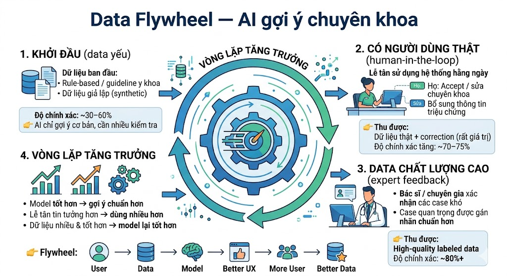

# SPEC — AI Product Hackathon

**Nhóm:** Group_3_E402

**Track:**  Vinmec 

---

## Problem statement
- Lễ tân và tổng đài hiện phải thủ công hỏi triệu chứng, tra cứu và tư vấn chuyên khoa cho từng bệnh nhân — mỗi ca mất 5–10 phút, dễ gây hàng chờ kéo dài khi lượng người tăng cao, ảnh hưởng đến trải nghiệm bệnh nhân và tạo áp lực lớn cho nhân viên tiếp nhận. Hệ thống AI được đề xuất để đảm nhận bước sàng lọc ban đầu — hỏi triệu chứng, gợi ý chuyên khoa phù hợp và đề xuất xếp phòng khám — giúp rút ngắn thời gian xử lý và tăng độ chính xác trong điều hướng, trong khi lễ tân vẫn là người xác nhận và quyết định cuối cùng.

---

## 1. AI Product Canvas

|   | Value | Trust | Feasibility |
|---|-------|-------|-------------|
| **Câu hỏi** | User nào? Pain gì? AI giải gì? | Khi AI sai thì sao? User sửa bằng cách nào? | Cost/latency bao nhiêu? Risk chính? |
| **Trả lời** | *Nhân viên văn phòng mất 30 phút/ngày phân loại email — AI gợi ý nhãn, giảm còn 5 phút* | *AI gắn sai nhãn → user thấy ngay, sửa 1 click, hệ thống học từ correction* | *~$0.01/email, latency <2s, risk: hallucinate nội dung nhạy cảm* |

**Automation hay augmentation?** ☐ Automation · ☐ Augmentation
Justify: *Augmentation — user thấy gợi ý và chấp nhận/từ chối, cost of reject = 0*

**Learning signal:**

1. User correction đi vào đâu? ___
2. Product thu signal gì để biết tốt lên hay tệ đi? ___
3. Data thuộc loại nào? ☐ User-specific · ☐ Domain-specific · ☐ Real-time · ☐ Human-judgment · ☐ Khác: ___
   Có marginal value không? (Model đã biết cái này chưa?) ___

---

## 2. User Stories — 4 paths

Mỗi feature chính = 1 bảng. AI trả lời xong → chuyện gì xảy ra?

### Feature: *tên feature*

**Trigger:** *VD: User nhận email mới → AI phân loại → ...*

| Path | Câu hỏi thiết kế | Mô tả |
|------|-------------------|-------|
| Happy — AI đúng, tự tin | User thấy gì? Flow kết thúc ra sao? | *Email tự gắn nhãn "Urgent", user thấy đúng, tiếp tục làm việc* |
| Low-confidence — AI không chắc | System báo "không chắc" bằng cách nào? User quyết thế nào? | *Hiện 2 nhãn gợi ý + confidence %, user chọn 1* |
| Failure — AI sai | User biết AI sai bằng cách nào? Recover ra sao? | *Email quan trọng bị gắn "FYI" → user thấy khi review → sửa nhãn* |
| Correction — user sửa | User sửa bằng cách nào? Data đó đi vào đâu? | *Kéo thả sang nhãn đúng → correction log → cải thiện model* |

*Lặp lại cho feature thứ 2-3 nếu có.*

---

## 3. Eval metrics + threshold

**Optimize precision hay recall?** ☐ Precision · ☐ Recall
Tại sao? ___
Nếu sai ngược lại thì chuyện gì xảy ra? *VD: Nếu chọn precision nhưng low recall → user không tìm thấy kết quả cần → bỏ dùng*

| Metric | Threshold | Red flag (dừng khi) |
|--------|-----------|---------------------|
| Precision@1 (chuyên khoa đúng nhất)  | ≥ 85%  | < 70% trong 7 ngày liên tục  |
|  Precision@3 (top 3 gợi ý) | ≥ 95% | < 90% trong 7 ngày liên tục |
| Coverage (tỷ lệ có gợi ý) | ≥ 90% | < 85% (AI từ chối trả lời hoặc “Tôi không chắc”) |
|Average Processing Time Reduction (thời gian lễ tân xử lý mỗi bệnh nhân) | ≥ 40% | < 25% (không cải thiện bottleneck “đọc, quyết định và thao tác nhập máy thủ công”) |
|CSAT (User Satisfaction - lễ tân) | ≥ 4.5/5 | < 4.0/5 (lễ tân phàn nàn nhiều về gợi ý sai hoặc không hữu ích) |
| Safety Red Flag (bổ sung) | Miss rate nghiêm trọng ≤ 1.5% | > 3% ca nghiêm trọng (Đau ngực, khó thở, xuất huyết…) |

Precision@1 & @3: Metric cốt lõi, đo trực tiếp success criteria “phân loại đúng trong đa số trường hợp”.

Coverage: Đảm bảo AI hỗ trợ tốt ngay cả triệu chứng dài/không rõ ràng.

Average Processing Time Reduction: Đo lường trực tiếp bottleneck lớn nhất (xử lý nhanh hơn khi lượng bệnh nhân đông).

CSAT: Khảo sát nhanh: “Bạn hài lòng với gợi ý chuyên khoa, mức độ khẩn cấp và bác sĩ của AI không?” (1–5 sao).

Safety Red Flag: Monitor riêng (rule-based + human review) – ưu tiên under-triage vì rủi ro sức khỏe cao nhất.
---

## 4. Top 3 failure modes

*Liệt kê cách product có thể fail — không phải list features.*
*"Failure mode nào user KHÔNG BIẾT bị sai? Đó là cái nguy hiểm nhất."*

| # | Trigger | Hậu quả | Mitigation |
|---|---------|---------|------------|
| 1 | Triệu chứng dài, mơ hồ, không điển hình hoặc kết hợp nhiều hệ cơ quan (đau bụng + chóng mặt + mệt mỏi…) | AI suy luận bệnh khả nghi sai → gợi ý sai chuyên khoa/bác sĩ. Lễ tân (đang đông) tin và điều hướng sai mà không biết → phân loại sai, tăng thời gian chờ đợi, trải nghiệm kém. | - Luôn trả top-3 + confidence score - Confidence < 65% → bắt buộc ghi “Gợi ý tham khảo, nên mô tả thêm hoặc hỏi lễ tân” - Rule-based safety layer: keyword nguy hiểm (đau ngực, khó thở, tê nửa người, nôn máu…) |
| 2 | Triệu chứng nghiêm trọng nhưng mô tả nhẹ/dùng từ thông thường (đau ngực nhẹ, khó thở thoáng qua…) | AI đánh giá mức độ khẩn cấp thấp hoặc gợi ý sai khoa (Nội thay vì Cấp cứu/Tim mạch). Lễ tân đang quá tải không biết và không ưu tiên → chậm xử lý ca nặng, rủi ro sức khỏe bệnh nhân. | - Hard-coded red-flag rules (ưu tiên cao nhất) - Tất cả red-flag cases → bắt buộc gợi ý Cấp cứu + cảnh báo rõ ràng - Cần human review toàn bộ red-flag cases hằng ngày |
| 3 | Model over-confident trên case hiếm, triệu chứng không điển hình hoặc có bias | AI trả lời rất tự tin nhưng sai → lễ tân đang quá tải dễ tin hoàn toàn và hành động theo mà không biết bị sai. | - Sử dụng uncertainty calibration (trả về confidence score) - Confidence < 70% → tone thận trọng - Weekly retrain + active learning trên case lễ tân/bác sĩ sửa - Theo dõi tỷ lệ các case mà AI và lễ tân/bác sĩ bất đồng ý kiến (<10%) |

---
## 5. ROI – 3 kịch bản

|   | **Conservative** | **Realistic** | **Optimistic** |
|---|------------------|---------------|----------------|
| **Assumption** | 100 bệnh nhân/ngày lễ tân sử dụng 40% thời gian Giảm thời gian xử lý > 16% | 500 bệnh nhân/ngày lễ tân sử dụng 60% thời gian Giảm thời gian xử lý > 24% | 2000 bệnh nhân/ngày (bệnh viện lớn) lễ tân sử dụng 90% thời gian Giảm thời gian xử lý >36% |
| **Cost** | 1 USD/ngày (~250.000 VND) inference + maintenance | 5 USD/ngày (~1,25 triệu VND) | 20 USD/ngày (~5 triệu VND) |
| **Benefit** | Giảm ~1,2–2 giờ làm việc lễ tân/ngày  | Giảm ~1,8–3 giờ làm việc lễ tân/ngày  | Giảm ~3–4,5 giờ làm việc lễ tân/ngày  Giảm khiếu nại từ bệnh nhân |
| **Net** | **+0,2 – 0,35 triệu VND/ngày** | **+1,9 – 2,5 triệu VND/ngày** | **+6 – 8 triệu VND/ngày** |

**Kill criteria (tiêu chí dừng dự án):**
- Net âm (cost > benefit) trong **2 tháng liên tục**.
- Safety Red Flag (under-triage nghiêm trọng) > 3% trong 7 ngày liên tục.
- CSAT của lễ tân < 4.0/5 trong 4 tuần liên tục.
- Precision@1 < 70% trong 7 ngày liên tục mà không cải thiện sau retrain.
- Lễ tân không chấp nhận sử dụng (adoption rate < 40% sau 1 tháng).
---

## 6. Mini AI spec (1 trang)

- Hiện tại, lễ tân và tổng đài phải tự hỏi triệu chứng, tra cứu và quyết định chuyên khoa cho từng bệnh nhân, mỗi ca mất khoảng 5–10 phút. Khi lượng bệnh nhân tăng, quy trình này nhanh chóng trở thành nút thắt cổ chai, gây ùn tắc, kéo dài thời gian chờ và tạo áp lực lớn lên nhân viên, đồng thời làm giảm trải nghiệm chung của bệnh nhân.

- Sản phẩm đề xuất giải quyết vấn đề này bằng cách đưa AI vào bước sàng lọc ban đầu. AI sẽ tự động hỏi các triệu chứng cơ bản, phân tích và gợi ý chuyên khoa phù hợp, thậm chí đề xuất phòng khám tương ứng. Tuy nhiên, hệ thống chỉ đóng vai trò hỗ trợ **augmentation**, không thay thế con người — lễ tân vẫn là người xác nhận và đưa ra quyết định cuối cùng.

- Về chất lượng, hệ thống được thiết kế ưu tiên **recall** cao để tránh bỏ sót các ca bệnh quan trọng, chấp nhận việc đôi khi đưa ra nhiều gợi ý khi không chắc chắn. Kèm theo đó là hiển thị mức độ confidence và cơ chế hỏi thêm hoặc cảnh báo rule-based trong các trường hợp có dấu hiệu nguy hiểm.

- Rủi ro chính nằm ở việc AI có thể gợi ý sai trong các ca mơ hồ hoặc nghiêm trọng, nên cần luôn giữ lễ tân trong vòng kiểm soát, đồng thời thiết kế các cơ chế fallback rõ ràng để giảm thiểu sai sót.

