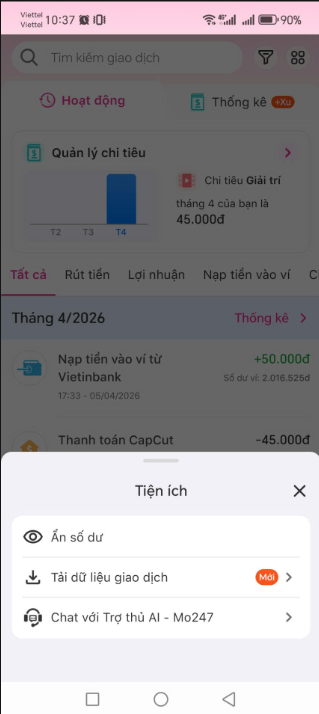
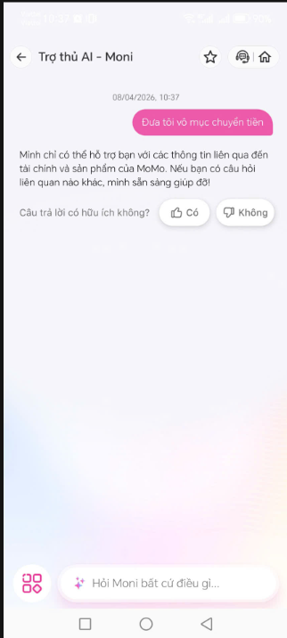
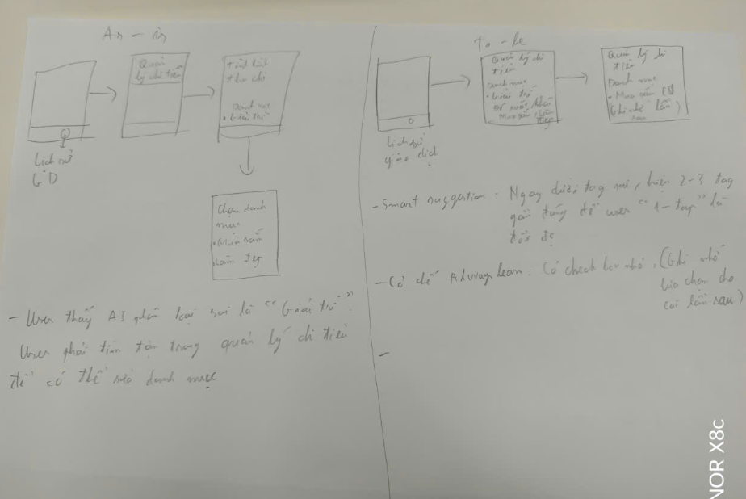

# Bài tập UX: phân tích sản phẩm AI thật

**Thời gian:** 40 phút | **Cá nhân** | **Output:** sketch giấy, nộp cuối bài

---

## Chọn 1 sản phẩm

| Sản phẩm | AI feature | Truy cập |
|----------|-----------|---------|
| MoMo — Trợ thủ AI Moni | Phân loại chi tiêu, chatbot tài chính | App MoMo |

---

## Phần 1 — Khám phá (15 phút)

**Trước khi dùng:** tìm hiểu sản phẩm marketing AI feature này thế nào — website, app store, bài PR. Sản phẩm hứa gì?
- Marketing (Lời hứa): MoMo quảng bá Moni là "Trợ thủ tài chính thông minh", giúp người dùng "Quản lý chi tiêu không chạm". Hứa hẹn: tự động phân loại giao dịch, nhắc nhở ngân sách, giải đáp thắc mắc tài chính bằng ngôn ngữ tự nhiên.

**Rồi dùng thử:** tải app / mở web, thử các tính năng AI. Quan sát kỹ: AI phản ứng thế nào? UI thay đổi gì? Có nút gì xuất hiện / biến mất?
- UI/UX: Moni xuất hiện như một chatbot trong tab "Lịch sử giao dịch" hoặc một biểu tượng nổi.
  - 
- Phản ứng: Chỉ có thể trả lời các thông tin chứ không hỗ trợ navigation sang các chức năng khác. 
  - 

## Phần 2 — Phân tích 4 paths (10 phút)

Dùng framework 4 paths để mổ xẻ sản phẩm:

| Path | Câu hỏi |
|------|---------|
| 1. Khi AI **đúng** | Hệ thống tự gắn tag (Ví dụ: "Ăn uống"). User thấy icon phân loại thay đổi ngay trong lịch sử. Moni gửi báo cáo cuối tuần: "Bạn đã chi X đồng cho Ăn uống". User cảm thấy được thấu hiểu. |
| 2. Khi AI **không chắc** | Moni thường để vào mục "Chưa phân loại" hoặc "Khác". Đôi khi Moni hiện một câu hỏi nhỏ trong chatbot: "Giao dịch 500k này là Tiền nhà hay Mua sắm vậy?".|
| 3. Khi AI **sai** | User phát hiện: Khi xem biểu đồ tròn thấy mục "Sức khỏe" cao bất thường (do AI nhầm thuốc tây với mỹ phẩm). Sửa: User phải bấm vào giao dịch -> Chọn "Sửa phân loại" -> Chọn lại category. Mất khoảng 3-4 bước. |
| 4. Khi user **mất tin** | User có thể tắt thông báo từ Moni hoặc ngừng vào xem báo cáo. Fallback: MoMo cho phép nhập tay (manual) hoàn toàn, nhưng nút "Nhập tay" đôi khi hơi sâu. Chưa có nút "Khiếu nại AI" rõ ràng. |

**Tự phân tích:**
- Path tốt nhất: Path 1 (Khi đúng). MoMo có data sạch từ các đối tác (The Coffee House, Highlands...) nên việc phân loại các hóa đơn này gần như chính xác 100%, tạo cảm giác rất "magic".
- Path yếu nhất: Path 3 (Khi sai). Việc sửa lỗi tốn nhiều bước và AI không có cơ chế "Học lại" rõ ràng (Ví dụ: Tôi sửa 1 lần, lần sau AI vẫn sai y hệt với cùng một người nhận).
- Gap Marketing vs Thực tế: Marketing hứa "Quản lý chi tiêu không chạm", nhưng thực tế nếu dùng tiền mặt hoặc chuyển khoản ngân hàng ngoài MoMo, user vẫn phải "chạm" rất nhiều để nhập liệu và sửa lỗi cho AI.

## Phần 3 — Sketch "làm tốt hơn" (10 phút)

Chọn **1 path yếu nhất** mà mình tìm được. Sketch trên giấy:

**As-is** (bên trái):  
  - Hình vẽ: Màn hình "Chi tiết giao dịch".
  - Mô tả: User thấy AI phân loại sai là "Mua sắm". User phải tìm nút "Sửa" (nhỏ), sau đó hiện ra một danh sách dài dằng dặc các category để chọn lại.

**To-be** (bên phải): 
  - Thiết kế mới:
      - Smart Suggestion: Ngay dưới tag sai, hiện 2-3 tag gợi ý gần đúng (Dựa trên lịch sử cũ) để user "1-tap" là đổi được ngay.
      - Cơ chế "Always Learn": Thêm một checkbox nhỏ: "Ghi nhớ lựa chọn này cho các lần sau?".

- 

## Phần 4 — Share + vote (5 phút)

- Nhóm em chọn nâng cấp Path 3 (Khi AI sai). Hiện tại Moni bắt user đi sâu vào menu để sửa category. Nhóm em đề xuất UI 'Gợi ý nhanh' ngay tại màn hình chính và thêm nút 'Remember this' để AI thực sự thông minh hơn sau mỗi lần user sửa lỗi, thay vì lặp lại lỗi cũ.

---

## Nộp bài

Mỗi người nộp sketch giấy + ghi chú phân tích 4 paths. Đây là **điểm cá nhân**.

**Nice to have:** screenshot màn hình app + annotate (khoanh, ghi chú) chỗ hay / chỗ gãy. Nộp kèm sketch.

---

## Tiêu chí chấm (10 điểm + bonus)

| Tiêu chí | Điểm |
|----------|------|
| Phân tích 4 paths đủ + nhận xét path yếu nhất | 4 |
| Sketch as-is + to-be rõ ràng | 4 |
| Nhận xét gap marketing vs thực tế | 2 |
| **Bonus:** nhóm vote sketch hay nhất | +bonus |

---

*Bài tập UX — Ngày 5 — VinUni A20 — AI Thực Chiến · 2026*
